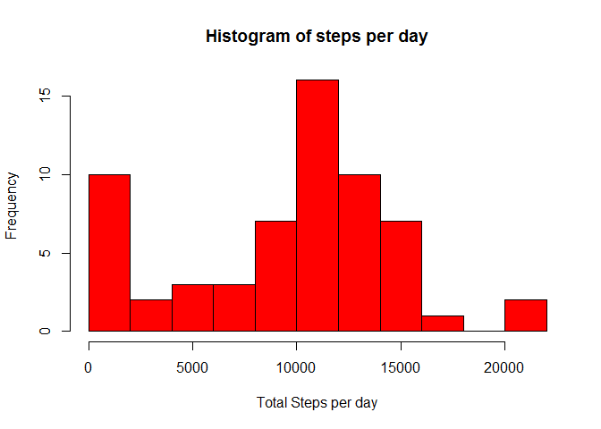
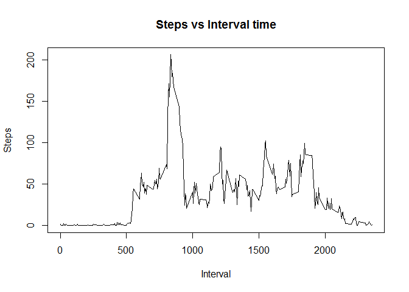
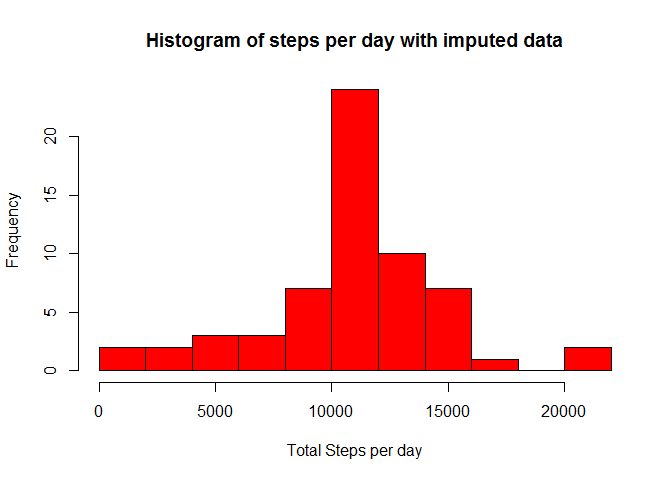
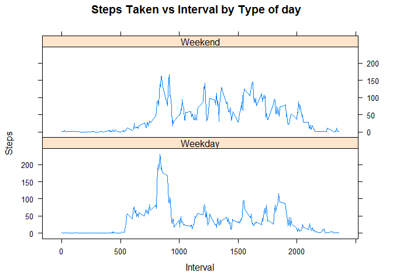

# Reproducible Research: Peer Assessment 1
Nick Lim  
18 September 2015  
## Loading and preprocessing the data

```r
library(plyr)
library(lattice)
activity=read.csv("activity.csv"); # Read file into dataframe activity
activity$date=as.Date(activity$date); # Process column date as Date
```

## What is mean total number of steps taken per day?

```r
aggregatedData=aggregate(activity$steps, by=list(activity$date),function(x) sum(x,na.rm=TRUE)); # Build DataFrame aggregatedDate by aggregating Steps byDate, (annonymous function built to omit NA rows)
aggregatedData=rename(aggregatedData,c("x"="Steps","Group.1"="Date")); #Rename columns to help with legibility.
hist(aggregatedData$Steps, breaks=15,main="Histogram of steps per day",xlab="Total Steps per day", col="red"); #Plot Histogram of Total Steps per day
```

 

```r
mean=mean(aggregatedData$Steps); #Calculate mean number of steps taken per day
median=median(aggregatedData$Steps); #Calculate median step taken per day
paste("Mean is",mean); #Report the mean and Median
```

```
## [1] "Mean is 9354.22950819672"
```

```r
paste("Median is",median);
```

```
## [1] "Median is 10395"
```
## What is the average daily activity pattern?

```r
intervalData=aggregate(activity$steps, by=list(activity$interval),function(x) mean(x,na.rm=TRUE)); # Build DataFrame intervalData by aggregating Steps by Interval, (annonymous function built to omit NA rows)
intervalData=rename(intervalData,c("x"="Steps","Group.1"="Interval")); #Rename columns to help with legibility.
plot(Steps~Interval,data=intervalData,type='l', main="Steps vs Interval time");
```

 

```r
maxInterval=intervalData[which.max(intervalData$Steps),1];
paste("Max Interval is",maxInterval); #Report the mean and Median
```

```
## [1] "Max Interval is 835"
```
## Imputing missing values

```r
imputeActivity=activity;

imputeActivity= transform(activity, steps=ifelse(is.na(steps),intervalData$Steps[intervalData$Interval==interval],steps)); #Imputing NA by taking average of corresponding interval (Gave up on trying to make this work, anyone who knows why only the first set of NA was successfully imputed, while the remaining set of NAs was ignored and is willing to explain why, is greatly appreciated)

for(i in 1:nrow(imputeActivity)) { steps=imputeActivity[i,'steps'];interval=imputeActivity[i,'interval']; if(is.na(steps)) {imputeActivity[i,'steps']=intervalData$Steps[intervalData$Interval==interval];};} # A less efficient way of transforming the data using for loops, at least it works as intended 

imputeAggregatedData=aggregate(imputeActivity$steps, by=list(imputeActivity$date),sum); # Build DataFrame aggregatedDate by aggregating Steps byDate, (annonymous function built to omit NA rows)
imputeAggregatedData=rename(imputeAggregatedData,c("x"="Steps","Group.1"="Date")); #Rename columns to help with legibility.
hist(imputeAggregatedData$Steps, breaks=15,main="Histogram of steps per day with imputed data",xlab="Total Steps per day", col="red"); #Plot Histogram of Total Steps per day
```

 

```r
imputedMean=mean(imputeAggregatedData$Steps); #Calculate mean number of steps taken per day
imputedMedian=median(imputeAggregatedData$Steps); #Calculate median step taken per day
paste("Mean is",imputedMean,";   Difference from original mean is",imputedMean-mean); #Report the mean and Median
```

```
## [1] "Mean is 10766.1886792453 ;   Difference from original mean is 1411.95917104856"
```

```r
paste("Median is",median,";    Difference from original median is",imputedMedian-median);
```

```
## [1] "Median is 10395 ;    Difference from original median is 371.188679245282"
```

## Are there differences in activity patterns between weekdays and weekends?

```r
weekends=c("Saturday","Sunday")
imputeActivity$Weekday[weekdays(imputeActivity$date) %in% weekends]="Weekend"
imputeActivity$Weekday[!(weekdays(imputeActivity$date) %in% weekends)]="Weekday"
## We can probably do this in 1 line, but real life dictates that I need to go out now and I can't be bothered fixing this to be more efficient

imputeIntervalData=aggregate(imputeActivity$steps, by=list(imputeActivity$interval,imputeActivity$Weekday),mean);
imputeIntervalData=rename(imputeIntervalData,c("x"="Steps","Group.1"="Interval", "Group.2"="Weektype"));
xyplot(Steps~Interval| Weektype,data= imputeIntervalData, type="l", layout=c(1,2),main="Steps Taken vs Interval by Type of day")
```

 
